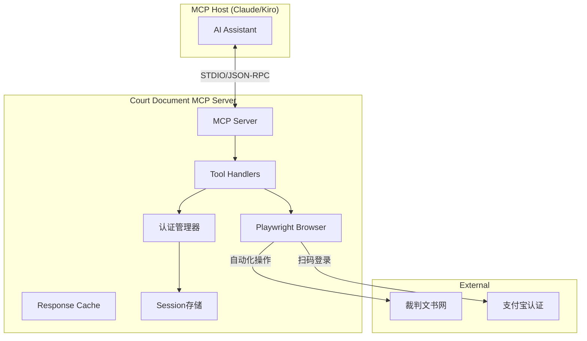
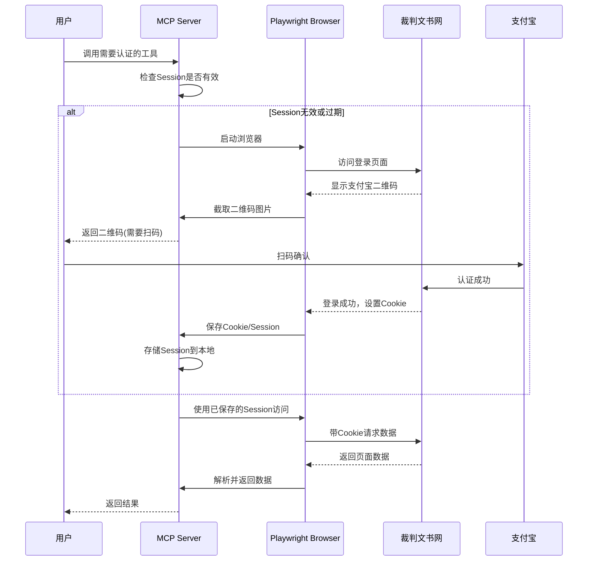

# Design Document: Court Document MCP

## Overview

本设计文档描述了裁判文书网MCP服务器的技术架构和实现方案。该MCP服务器将使AI助手能够查询、检索和分析中国裁判文书网（https://wenshu.court.gov.cn/）的公开裁判文书数据。

**重要说明**: 裁判文书网需要用户通过支付宝扫码登录才能访问数据，因此本MCP服务器需要实现认证管理功能。

### 技术选型

- **语言**: TypeScript
- **运行时**: Node.js
- **MCP SDK**: @modelcontextprotocol/sdk
- **浏览器自动化**: Playwright (用于处理登录和反爬虫)
- **传输方式**: STDIO (标准输入输出)
- **认证方式**: 支付宝扫码登录 + Cookie/Session管理

**技术说明**: 裁判文书网有复杂的反爬虫机制，直接HTTP请求无法访问。本项目使用Playwright进行浏览器自动化，模拟真实用户操作来获取数据。

### 浏览器运行模式

Playwright支持两种运行模式，用户可通过配置选择：

| 模式         | 配置              | 说明                                           | 适用场景             |
| ------------ | ----------------- | ---------------------------------------------- | -------------------- |
| **无头模式** | `headless: true`  | 不弹出浏览器窗口，二维码通过截图返回Base64图片 | 服务器部署、后台运行 |
| **有头模式** | `headless: false` | 弹出浏览器窗口，用户直接在窗口中扫码           | 本地开发、首次登录   |

**默认配置**: 无头模式（不弹出浏览器）

**登录流程**:
- 无头模式：调用 `login_qrcode` 工具获取二维码图片，用户扫码后调用 `wait_login` 等待登录完成
- 有头模式：调用 `login_with_browser` 工具弹出浏览器窗口，用户直接扫码，登录成功后自动关闭窗口

## Architecture



### 认证流程



### 数据流

1. AI助手通过MCP协议发送工具调用请求
2. MCP服务器检查本地Session是否有效
3. 如需登录，启动Playwright浏览器访问登录页面
4. 截取支付宝二维码返回给用户
5. 用户扫码完成认证后，保存Cookie/Session
6. 使用Playwright操作浏览器获取数据
7. 解析页面内容并返回给AI助手

## Components and Interfaces

### 1. MCP Server Core

```typescript
// src/服务器.ts
import { McpServer } from "@modelcontextprotocol/sdk/server/mcp.js";
import { StdioServerTransport } from "@modelcontextprotocol/sdk/server/stdio.js";

const server = new McpServer({
  name: "court-document-server",
  version: "1.0.0",
});
```

### 2. 认证管理模块

```typescript
// src/认证/管理器.ts
interface 认证状态 {
  已登录: boolean;
  cookies?: string;
  过期时间?: Date;
}

interface 二维码信息 {
  二维码图片Base64: string;  // 截图的二维码图片
  说明: string;
}

class 认证管理器 {
  private sessionPath: string;
  private 状态: 认证状态;
  private browser: Browser | null;
  private context: BrowserContext | null;
  
  constructor(sessionPath?: string) {
    this.sessionPath = sessionPath || './session-data';
    this.状态 = { 已登录: false };
    this.browser = null;
    this.context = null;
  }
  
  async 初始化浏览器(): Promise<void> {
    // 启动Playwright浏览器
  }
  
  async 检查登录状态(): Promise<boolean> {
    // 检查本地存储的session是否有效
    // 尝试访问需要登录的页面验证
  }
  
  async 获取登录二维码(): Promise<二维码信息> {
    // 访问登录页面，截取支付宝二维码图片
  }
  
  async 等待登录完成(超时秒数: number): Promise<boolean> {
    // 轮询检查用户是否已扫码登录成功
  }
  
  async 保存Session(): Promise<void> {
    // 保存浏览器cookies和storage到本地文件
  }
  
  async 加载Session(): Promise<boolean> {
    // 从本地文件加载session到浏览器
  }
  
  async 关闭浏览器(): Promise<void> {
    // 关闭浏览器实例
  }
}
```

### 3. 浏览器操作模块

```typescript
// src/浏览器/操作器.ts
class 文书网操作器 {
  private page: Page;
  
  constructor(page: Page) {
    this.page = page;
  }
  
  async 搜索文书(关键词: string, 筛选条件?: 筛选参数): Promise<文书摘要[]> {
    // 在搜索框输入关键词
    // 设置筛选条件
    // 点击搜索按钮
    // 等待结果加载
    // 解析搜索结果列表
  }
  
  async 获取文书详情(文书ID: string): Promise<文书详情> {
    // 导航到文书详情页
    // 等待内容加载
    // 解析文书内容和元数据
  }
  
  async 翻页(页码: number): Promise<void> {
    // 点击分页按钮
    // 等待新页面加载
  }
}
```

### 3. Tool Definitions

#### login_status - 检查登录状态工具

```typescript
interface 登录状态输出 {
  已登录: boolean;
  消息: string;
}
```

#### login_qrcode - 获取登录二维码工具

```typescript
interface 登录二维码输出 {
  二维码图片: string;        // Base64编码的二维码图片
  说明: string;
  过期秒数: number;
}
```

#### wait_login - 等待登录完成工具

```typescript
interface 等待登录输入 {
  超时秒数?: number;         // 默认120秒
}

interface 等待登录输出 {
  成功: boolean;
  消息: string;
}
```

#### login_with_browser - 弹出浏览器登录工具（有头模式）

```typescript
interface 浏览器登录输入 {
  超时秒数?: number;         // 默认180秒
}

interface 浏览器登录输出 {
  成功: boolean;
  消息: string;
}
```

**说明**: 此工具会弹出浏览器窗口，用户可以直接在窗口中看到二维码并扫码登录。登录成功后浏览器窗口自动关闭。

#### search_documents - 文书搜索工具

```typescript
interface SearchDocumentsInput {
  keyword: string;           // 搜索关键词
  caseType?: CaseType;       // 案件类型筛选
  courtLevel?: CourtLevel;   // 法院级别筛选
  startDate?: string;        // 开始日期 (YYYY-MM-DD)
  endDate?: string;          // 结束日期 (YYYY-MM-DD)
  page?: number;             // 页码，默认1
  pageSize?: number;         // 每页数量，默认20
}

interface SearchDocumentsOutput {
  total: number;             // 总结果数
  page: number;              // 当前页码
  pageSize: number;          // 每页数量
  documents: 文书摘要[];
}

interface 文书摘要 {
  文书ID: string;            // 文书ID
  案件名称: string;          // 案件名称
  案号: string;              // 案号
  法院名称: string;          // 法院名称
  裁判日期: string;          // 裁判日期
  案件类型: string;          // 案件类型
}
```

#### get_document - 获取文书详情工具

```typescript
interface GetDocumentInput {
  docId: string;             // 文书ID或案号
}

interface 文书详情 {
  文书ID: string;
  案件名称: string;
  案号: string;
  法院名称: string;
  法院级别: string;
  裁判日期: string;
  案件类型: string;
  当事人: 当事人信息[];
  审判人员: string[];
  文书全文: string;
  案由: string;
}

interface 当事人信息 {
  姓名: string;
  角色: string;              // 原告/被告/上诉人等
}
```

#### list_case_types - 列出案件类型工具

```typescript
interface 案件类型信息 {
  代码: string;              // 类型代码
  名称: string;              // 中文名称
  描述: string;              // 描述
}

// 返回: 案件类型信息[]
```

#### list_court_levels - 列出法院级别工具

```typescript
interface 法院级别信息 {
  代码: string;              // 级别代码
  名称: string;              // 中文名称
  描述: string;              // 描述
}

// 返回: 法院级别信息[]
```

### 5. HTTP Client Module (备用)

```typescript
// src/客户端/index.ts - 仅用于简单请求，主要功能通过Playwright实现
```

### 6. Error Handler

```typescript
// src/错误/index.ts
enum 错误代码 {
  参数无效 = "INVALID_PARAMS",
  未找到 = "NOT_FOUND",
  服务不可用 = "SERVICE_UNAVAILABLE",
  请求限流 = "RATE_LIMITED",
  内部错误 = "INTERNAL_ERROR",
  需要登录 = "AUTH_REQUIRED",
  登录过期 = "AUTH_EXPIRED",
}

interface MCP错误 {
  代码: 错误代码;
  消息: string;
  详情?: Record<string, unknown>;
  重试等待?: number;         // 对于限流错误
  二维码URL?: string;        // 对于需要登录错误
}

class 需要登录错误 extends Error {
  二维码URL?: string;
  
  constructor(message: string, 二维码URL?: string) {
    super(message);
    this.二维码URL = 二维码URL;
  }
}
```

## Data Models

### 案件类型枚举

```typescript
enum 案件类型 {
  刑事 = "xingshi",          // 刑事案件
  民事 = "minshi",           // 民事案件
  行政 = "xingzheng",        // 行政案件
  赔偿 = "peichang",         // 赔偿案件
  执行 = "zhixing",          // 执行案件
}

const 案件类型映射: Record<案件类型, 案件类型信息> = {
  [案件类型.刑事]: { 代码: "xingshi", 名称: "刑事案件", 描述: "刑事诉讼案件" },
  [案件类型.民事]: { 代码: "minshi", 名称: "民事案件", 描述: "民事诉讼案件" },
  [案件类型.行政]: { 代码: "xingzheng", 名称: "行政案件", 描述: "行政诉讼案件" },
  [案件类型.赔偿]: { 代码: "peichang", 名称: "赔偿案件", 描述: "国家赔偿案件" },
  [案件类型.执行]: { 代码: "zhixing", 名称: "执行案件", 描述: "执行程序案件" },
};
```

### 法院级别枚举

```typescript
enum 法院级别 {
  最高 = "zuigao",           // 最高人民法院
  高级 = "gaoji",            // 高级人民法院
  中级 = "zhongji",          // 中级人民法院
  基层 = "jiceng",           // 基层人民法院
}

const 法院级别映射: Record<法院级别, 法院级别信息> = {
  [法院级别.最高]: { 代码: "zuigao", 名称: "最高人民法院", 描述: "最高人民法院" },
  [法院级别.高级]: { 代码: "gaoji", 名称: "高级人民法院", 描述: "省级高级人民法院" },
  [法院级别.中级]: { 代码: "zhongji", 名称: "中级人民法院", 描述: "地市级中级人民法院" },
  [法院级别.基层]: { 代码: "jiceng", 名称: "基层人民法院", 描述: "区县级基层人民法院" },
};
```

### 认证Session存储

```typescript
interface Session存储格式 {
  cookies: Array<{
    name: string;
    value: string;
    domain: string;
    path: string;
    expires: number;
  }>;
  localStorage?: Record<string, string>;
  创建时间: string;
  过期时间: string;
}
```

### 分页响应结构

```typescript
interface 分页响应<T> {
  数据: T[];
  分页信息: {
    总数: number;
    当前页: number;
    每页数量: number;
    总页数: number;
  };
}
```

## Correctness Properties

*A property is a characteristic or behavior that should hold true across all valid executions of a system—essentially, a formal statement about what the system should do. Properties serve as the bridge between human-readable specifications and machine-verifiable correctness guarantees.*

### Property 1: Search Results Structure Completeness

*For any* search query that returns results, each document in the result set SHALL contain all required fields: 文书ID, 案件名称, 案号, 法院名称, and 裁判日期.

**Validates: Requirements 1.2**

### Property 2: Filter Correctness

*For any* search with filters applied (caseType, courtLevel, or dateRange), all returned documents SHALL satisfy ALL specified filter conditions (AND logic).

**Validates: Requirements 2.1, 2.2, 2.3, 2.4**

### Property 3: Document Retrieval Completeness

*For any* valid document ID, the returned document SHALL contain all required metadata fields: 文书ID, 案件名称, 案号, 法院名称, 法院级别, 裁判日期, 案件类型, 当事人, 审判人员, 文书全文, and 案由.

**Validates: Requirements 3.1, 3.2**

### Property 4: Metadata Bilingual Format

*For any* case type or court level returned by list tools, the item SHALL include both a 代码 and a 名称.

**Validates: Requirements 4.3**

### Property 5: Pagination Consistency

*For any* paginated search response, the response SHALL include 总数, 当前页, and 每页数量, and the number of returned items SHALL NOT exceed the specified page size.

**Validates: Requirements 5.1, 5.2**

### Property 6: Authentication State Consistency

*For any* authentication check, if the stored token exists and has not expired, the system SHALL report logged-in status; otherwise, it SHALL report not-logged-in status with a QR code URL.

**Validates: Requirements 7.1, 7.2** (新增认证需求)

## Error Handling

### Error Response Format

所有错误响应遵循统一格式：

```typescript
{
  isError: true,
  content: [{
    type: "text",
    text: JSON.stringify({
      code: ErrorCode,
      message: string,
      details?: object,
      retryAfter?: number
    })
  }]
}
```

### Error Scenarios

| 场景          | 错误码              | 处理方式               |
| ------------- | ------------------- | ---------------------- |
| 参数验证失败  | INVALID_PARAMS      | 返回具体的验证错误信息 |
| 文书不存在    | NOT_FOUND           | 返回友好的未找到提示   |
| API服务不可用 | SERVICE_UNAVAILABLE | 返回重试建议           |
| 请求频率限制  | RATE_LIMITED        | 返回retryAfter时间     |
| 内部错误      | INTERNAL_ERROR      | 记录日志，返回通用错误 |

### 重试策略

```typescript
const RETRY_CONFIG = {
  maxRetries: 3,
  baseDelay: 1000,      // 1秒
  maxDelay: 10000,      // 10秒
  backoffMultiplier: 2,
};
```

## Testing Strategy

### 测试框架

- **单元测试**: Vitest
- **属性测试**: fast-check
- **集成测试**: Vitest + MSW (Mock Service Worker)

### 单元测试

单元测试覆盖以下场景：

1. 参数验证逻辑
2. 数据转换和格式化
3. 错误处理逻辑
4. 枚举和常量定义

### 属性测试

每个正确性属性对应一个属性测试，使用fast-check生成随机输入：

```typescript
import * as fc from 'fast-check';

// Property 1: Search Results Structure Completeness
test.prop([fc.array(documentSummaryArb)])('search results have all required fields', (docs) => {
  // 验证每个文档包含所有必需字段
});

// Property 2: Filter Correctness
test.prop([fc.record({...})])('filters are applied with AND logic', (filters) => {
  // 验证所有返回结果满足所有筛选条件
});
```

### 测试配置

```typescript
// vitest.config.ts
export default defineConfig({
  test: {
    globals: true,
    environment: 'node',
    coverage: {
      provider: 'v8',
      reporter: ['text', 'json', 'html'],
    },
  },
});
```

### 属性测试迭代次数

每个属性测试运行至少100次迭代，以确保充分覆盖输入空间。

## Project Structure

```
court-document-mcp/
├── src/
│   ├── server.ts           # MCP服务器入口
│   ├── tools/
│   │   ├── search.ts       # 搜索工具
│   │   ├── document.ts     # 文书详情工具
│   │   ├── metadata.ts     # 元数据工具
│   │   └── auth.ts         # 认证相关工具
│   ├── browser/
│   │   ├── manager.ts      # Playwright浏览器管理
│   │   └── operator.ts     # 页面操作封装
│   ├── auth/
│   │   ├── manager.ts      # 认证管理器
│   │   └── session-store.ts # Session持久化
│   ├── parser/
│   │   ├── search-result.ts # 搜索结果页面解析
│   │   └── document-detail.ts # 文书详情页面解析
│   ├── models/
│   │   ├── case-type.ts    # 案件类型
│   │   ├── court-level.ts  # 法院级别
│   │   └── document.ts     # 文书模型
│   ├── errors/
│   │   └── index.ts        # 错误处理
│   └── utils/
│       └── validation.ts   # 参数验证
├── tests/
│   ├── unit/               # 单元测试
│   ├── property/           # 属性测试
│   └── integration/        # 集成测试
├── session-data/           # Session存储目录
├── package.json
├── tsconfig.json
├── playwright.config.ts    # Playwright配置
└── vitest.config.ts
```
